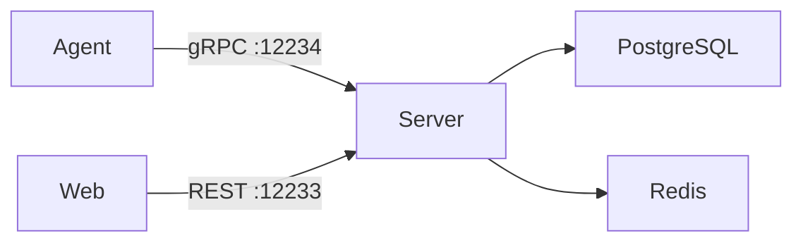

# Vord Fleet

[](https://github.com/framlux/vord/actions/workflows/ci.yaml)

Vord Fleet is a fleet management and telemetry platform for Linux servers. Organizations manage machines across multi-tenant workspaces with subscription tiers (Free, Pro, Team). Lightweight agents installed on managed machines collect system telemetry and report it to the central server via gRPC.

## License

This repository uses a dual-license structure:

- **MIT** — `src/agent/` (Go agent) and `src/grpc/protos/` (Protobuf definitions) are fully open source under the [MIT License](https://opensource.org/licenses/MIT).
- **FSL-1.1-ALv2** — All other source code (`src/server/`, `src/database/`, `src/migrationRunner/`, `src/web/`, `test/`) is licensed under the [Functional Source License, Version 1.1, ALv2](https://fsl.software/FSL-1.1-ALv2.template.md). This license converts to Apache License 2.0 two years after each version is released. You may use, modify, and self-host the FSL-licensed code, but you may not offer it as a competing hosted service.

Each component directory contains a `LICENSE` file with the full license text. See [`LICENSE.md`](LICENSE.md) for the complete breakdown.

## Architecture Overview

**Server** — .NET 10 API server built with FastEndpoints (REST) and gRPC (agent control plane). Handles authentication, subscription enforcement, telemetry ingestion, and all business logic.

**Web** — SvelteKit 5 frontend with Skeleton UI v3. Provides the dashboard for managing machines, users, tenants, and subscriptions. Authenticates via OIDC through the server.

**Agent** — Go binary deployed on managed Linux machines under root privilege. Maintains a local SQLite database for queuing telemetry, communicates with the server via gRPC, and executes remote commands when enabled.

**Database** — Shared .NET library containing LinqToDB models and FluentMigrator migration definitions. PostgreSQL is the production data store.

**Migration Runner** — Standalone .NET service that applies database schema migrations. Runs to completion before the API server starts.

### Data Flow



### Ports

| Service    | Port  | Protocol       |
|------------|-------|----------------|
| Server HTTP | 12233 | HTTP/1.1 (REST) |
| Server gRPC | 12234 | HTTP/2 (gRPC)  |
| Web UI     | 5254  | HTTP           |
| PostgreSQL | 5432  | TCP            |
| Redis      | 6379  | TCP            |

### Authentication

- **Web users** — OIDC/OAuth via GitHub, Google, and Microsoft social login. Team-tier tenants can configure a custom OIDC provider.
- **Agents** — API key issued per machine during registration, scoped to a tenant with an active subscription.
- **Roles** — Admin, TenantAdmin, MachineAdmin, Viewer.

## Repository Structure

```
src/
├── server/          # .NET API server (FastEndpoints + gRPC)
├── web/             # SvelteKit frontend
├── agent/           # Go agent for managed machines (MIT)
├── database/        # LinqToDB models & FluentMigrator migrations
├── grpc/            # Protobuf service definitions (MIT)
└── migrationRunner/ # Database migration runner
deployment/
├── agent/           # Agent install script
└── server/
    └── docker/      # Docker Compose stack + .env template
test/
├── unit/            # TUnit unit tests
└── functional/      # TUnit functional tests (in-memory SQLite)
```

## Self-Hosting

Vord Fleet can be self-hosted using Docker Compose. The built-in billing integration (Stripe) is disabled by default and is not required for self-hosted deployments.

### Prerequisites

- Docker and Docker Compose
- At least one OAuth provider configured (GitHub, Google, or Microsoft) for user sign-in

### Quick Start

1. Copy the environment template:

   ```bash
   cp deployment/server/docker/.env.example deployment/server/docker/.env
   ```

2. Edit `deployment/server/docker/.env`:

   ```bash
   # Set a secure database password
   DB_PASSWORD=your-secure-password

   # Set your domain (or http://localhost:5254 for local testing)
   CORS_ORIGIN=https://your-domain.example
   APP_BASE_URL=https://your-domain.example

   # Configure at least one OAuth provider for user login
   GITHUB_CLIENT_ID=your-client-id
   GITHUB_CLIENT_SECRET=your-client-secret

   # Billing is disabled by default — no Stripe account needed
   Billing__Enabled=false

   # Without billing, all tenants use the free tier limits.
   # Set these to generous values for your deployment:
   FREE_TIER_MACHINE_LIMIT=10000
   FREE_TIER_RETENTION_DAYS=365
   ```

3. Start the stack:

   ```bash
   docker compose -f deployment/server/docker/docker-compose.yml up -d
   ```

4. Access the web UI at `http://localhost:5254` (or your configured `WEB_PORT`).

### Disabling Billing

When `Billing__Enabled=false` (the default), the server registers a no-op billing client. All subscription checks pass, and no Stripe account or billing API is required. Every tenant operates under the free tier limits, so adjust `FREE_TIER_MACHINE_LIMIT` and `FREE_TIER_RETENTION_DAYS` to match your needs.

### Optional Services

- **Email (Resend)** — If `RESEND_API_KEY` is not set, tenant invitations will not be sent via email. The application still functions; you can share invitation links manually.
- **OIDC/SSO** — The `OIDC_*` variables are only needed if you want to configure a custom OIDC provider for single sign-on. Social login (GitHub/Google/Microsoft) works without these.
- **Data Export** — Requires S3-compatible object storage (`ObjectStorage__*` config). Without it, the export endpoint returns 501. [SeaweedFS](https://github.com/seaweedfs/seaweedfs) (Apache 2.0) is recommended for self-hosted S3-compatible storage.

### Reverse Proxy

The server is designed to run behind an SSL-terminating reverse proxy (nginx, Traefik, etc.). The Docker Compose stack sets `ASPNETCORE_FORWARDEDHEADERS_ENABLED=true` so the server correctly reads `X-Forwarded-For`, `X-Forwarded-Proto`, and `X-Forwarded-Host` headers from your proxy.

## Running with Docker Compose

### Containers

| Container          | Image                                         | Purpose                              |
|--------------------|-----------------------------------------------|--------------------------------------|
| `postgres`         | `postgres:17-alpine`                          | Primary data store                   |
| `redis`            | `redis:7-alpine`                              | Caching and rate limiting            |
| `migration-runner` | `ghcr.io/framlux/vord/migration_runner`       | Applies schema migrations, then exits |
| `api-server`       | `ghcr.io/framlux/vord/api-server`             | REST API + gRPC control plane        |
| `web`              | `ghcr.io/framlux/vord/web`                    | SvelteKit dashboard                  |

### Startup Order

All containers include health checks. Compose enforces this dependency chain:

1. `postgres` and `redis` start first and must pass health checks.
2. `migration-runner` starts after `postgres` is healthy, applies migrations, and exposes a readiness endpoint.
3. `api-server` starts after `postgres`, `redis`, and `migration-runner` are all healthy.
4. `web` starts after `api-server` is healthy.

### Exposed Ports

Configurable via `.env`:

| Variable         | Default | Maps to         |
|------------------|---------|-----------------|
| `API_HTTP_PORT`  | 12233   | Server REST API |
| `API_GRPC_PORT`  | 12234   | Server gRPC     |
| `WEB_PORT`       | 5254    | Web UI          |

## Configuration Reference

### Server

Configured via `appsettings.json` or environment variables using double-underscore notation (e.g., `Database__HOSTNAME`).

#### Database

| Key                  | Description             | Default | Required |
|----------------------|-------------------------|---------|----------|
| `Database__HOSTNAME` | PostgreSQL host         | —       | Yes      |
| `Database__USER`     | PostgreSQL user         | —       | Yes      |
| `Database__PASSWORD` | PostgreSQL password     | —       | Yes      |
| `Database__DB`       | PostgreSQL database name | —      | Yes      |

#### Redis

| Key                       | Description             | Default          | Required |
|---------------------------|-------------------------|------------------|----------|
| `Redis__ConnectionString` | Redis connection string | `localhost:6379` | Yes      |

#### CORS

| Key                  | Description               | Default | Required |
|----------------------|---------------------------|---------|----------|
| `Cors__Origins__0`   | First allowed origin      | —       | Yes      |

Additional origins can be added by incrementing the index (`Cors__Origins__1`, etc.).

#### Application

| Key              | Description                    | Default | Required |
|------------------|--------------------------------|---------|----------|
| `App__BaseUrl`   | Public-facing base URL         | —       | Yes      |

#### Authentication — OAuth

| Key                                        | Description                | Default | Required |
|--------------------------------------------|----------------------------|---------|----------|
| `Authentication__GitHub__ClientId`          | GitHub OAuth client ID     | —       | No       |
| `Authentication__GitHub__ClientSecret`      | GitHub OAuth client secret | —       | No       |
| `Authentication__Google__ClientId`          | Google OAuth client ID     | —       | No       |
| `Authentication__Google__ClientSecret`      | Google OAuth client secret | —       | No       |
| `Authentication__Microsoft__ClientId`       | Microsoft OAuth client ID  | —       | No       |
| `Authentication__Microsoft__ClientSecret`   | Microsoft OAuth secret     | —       | No       |

At least one OAuth provider should be configured for user sign-in.

#### Authentication — OIDC (SSO)

| Key                                        | Description               | Default | Required |
|--------------------------------------------|---------------------------|---------|----------|
| `Authentication__Oidc__Authority`          | OIDC issuer URL           | —       | No       |
| `Authentication__Oidc__ClientId`           | OIDC client ID            | —       | No       |
| `Authentication__Oidc__ClientSecret`       | OIDC client secret        | —       | No       |
| `Authentication__Oidc__MetadataAddress`    | OIDC discovery endpoint   | —       | No       |
| `Authentication__Oidc__CallbackUrlBase`    | Override callback URL base | —      | No       |

These are only required if you configure a custom OIDC provider for single sign-on.

#### Billing

| Key                  | Description                                          | Default | Required |
|----------------------|------------------------------------------------------|---------|----------|
| `Billing__Enabled`   | Enable Stripe billing integration                    | `false` | No       |

When disabled (the default), a no-op billing client is registered and no Stripe configuration is needed. When enabled, the server expects a Stripe billing API to be available.

#### Authentication — Cookies

| Key                    | Description                              | Default | Required |
|------------------------|------------------------------------------|---------|----------|
| `Auth__CookieDomain`  | Cookie domain for cross-subdomain auth   | —       | No       |

Only needed when running behind a custom domain (e.g., `.example.com`). When not set, cookies are scoped to the current host.

#### Object Storage (Data Export)

| Key                         | Description                         | Default      | Required |
|-----------------------------|-------------------------------------|--------------|----------|
| `ObjectStorage__BucketName` | S3-compatible bucket name           | —            | No       |
| `ObjectStorage__Endpoint`   | S3-compatible endpoint URL          | —            | No       |
| `ObjectStorage__AccessKey`  | S3 access key                       | —            | No       |
| `ObjectStorage__SecretKey`  | S3 secret key                       | —            | No       |
| `ObjectStorage__Region`     | S3 region                           | `us-east-1`  | No       |

Required only if you want to enable the tenant data export feature. When not configured, the export endpoint returns 501. Works with any S3-compatible provider (AWS S3, MinIO, etc.).

#### Subscription

| Key                                    | Description                          | Default | Required |
|----------------------------------------|--------------------------------------|---------|----------|
| `Subscription__FreeTierMachineLimit`   | Max machines for free tier           | 3       | No       |
| `Subscription__FreeTierRetentionDays`  | Telemetry retention days (free tier) | 1       | No       |

Self-hosters: set these to higher values for your deployment (e.g., `10000` machines, `365` days).

#### Email (Resend)

| Key                   | Description        | Default | Required |
|-----------------------|--------------------|---------|----------|
| `Resend__ApiKey`      | Resend API key     | —       | No       |
| `Resend__FromEmail`   | Sender address     | —       | No       |

Email is optional. Without it, invitation emails will not be sent but the application remains functional.

#### Server Defaults

| Key                                          | Description                               | Default |
|----------------------------------------------|-------------------------------------------|---------|
| `ServerDefaults__AgentHeartbeatSeconds`       | Expected agent heartbeat interval         | 300     |
| `ServerDefaults__AgentConfigRefreshSeconds`   | Agent config refresh interval             | 21600   |
| `ServerDefaults__OnlineThresholdSeconds`      | Seconds before a machine is marked offline | 300    |
| `ServerDefaults__CertificateExpiryWarningDays`| Days before cert expiry to warn           | 30      |
| `ServerDefaults__TelemetryCleanupGraceDays`   | Grace period before telemetry cleanup     | 7       |
| `ServerDefaults__DeduplicationTtlSeconds`     | Deduplication window for telemetry        | 300     |

#### Telemetry

| Key                        | Description                          | Default |
|----------------------------|--------------------------------------|---------|
| `Telemetry__RetentionDays` | Days to retain telemetry data        | 90      |

#### Logging

| Key                                             | Description                | Default       |
|-------------------------------------------------|----------------------------|---------------|
| `Serilog__MinimumLevel__Default`                | Default log level          | `Information` |
| `Serilog__MinimumLevel__Override__FastEndpoints` | FastEndpoints log level   | `Warning`     |

### Web UI

| Key              | Description                                      | Default      | Required |
|------------------|--------------------------------------------------|--------------|----------|
| `API_BASE_URL`   | Server-side base URL for API calls (runtime)     | —            | Yes      |
| `PORT`           | Port the web server listens on                   | `5254`       | No       |
| `NODE_ENV`       | Node environment                                 | `production` | No       |

### Agent

Configuration priority: CLI flags > TOML file > environment variables > defaults.

TOML config file location: `/etc/framlux/vord-agent.toml`

| CLI Flag                 | Env Variable                  | TOML Key                | Description                          | Default                |
|--------------------------|-------------------------------|-------------------------|--------------------------------------|------------------------|
| `-server`                | `VORD_SERVER_ADDRESS`         | `server_address`        | Server address                       | `localhost`            |
| `-port`                  | `VORD_SERVER_PORT`            | `server_port`           | Server gRPC port                     | `12234`                |
| `-data-dir`              | `VORD_DATA_DIR`               | `data_dir`              | Data directory for SQLite and state  | `/var/lib/vord-agent`  |
| `-log-level`             | `VORD_LOG_LEVEL`              | `log_level`             | Log level (debug, info, warn, error) | `info`                 |
| `-insecure`              | `VORD_USE_TLS`                | `use_tls`               | TLS for gRPC (`-insecure` disables)  | `true`                 |
| `-allow-remote-commands` | `VORD_ALLOW_REMOTE_COMMANDS`  | `allow_remote_commands` | Allow server to execute commands     | `false`                |
| `-registration-token`    | `VORD_REGISTRATION_TOKEN`     | `registration_token`    | Token for tenant registration        | —                      |

### Migration Runner

Uses the same `Database__*` environment variables as the server:

| Key                  | Description             | Required |
|----------------------|-------------------------|----------|
| `Database__HOSTNAME` | PostgreSQL host         | Yes      |
| `Database__USER`     | PostgreSQL user         | Yes      |
| `Database__PASSWORD` | PostgreSQL password     | Yes      |
| `Database__DB`       | PostgreSQL database name | Yes     |

## Development

### Build

```bash
# Full .NET solution
dotnet build machine-info.slnx

# Go agent
cd src/agent && go build ./...

# Web UI
cd src/web && pnpm install && pnpm dev
```

### Test

```bash
# .NET unit tests (TUnit — runs as an executable)
dotnet run --project test/unit/unit.csproj

# .NET functional tests (full HTTP pipeline with in-memory SQLite)
dotnet run --project test/functional/functional.csproj

# Go agent tests
cd src/agent && go test ./...
```

### Dev Ports

| Service        | Port  | Notes                         |
|----------------|-------|-------------------------------|
| Server HTTP    | 12233 | `http://127.0.0.1:12233`     |
| Server gRPC    | 12234 | `http://127.0.0.1:12234`     |
| Web dev server | 5173  | Vite dev server               |

## Agent Installation

Install the agent on a managed Linux machine:

```bash
curl -fsSL https://get.vordfleet.dev/install.sh | sudo bash
```

The script:

1. Detects the package manager (apt, dnf, or yum).
2. Imports the Framlux GPG key and adds the package repository.
3. Installs the `vord-agent` package.
4. Prompts for the server address (default: `grpc.vordfleet.dev`) and a registration token.
5. Writes configuration to `/etc/framlux/vord-agent.toml`.
6. Enables and starts the `vord-agent` systemd service.

Registration tokens are found in the Vord Fleet dashboard under Tenant Settings.

## Contributing

See `CLAUDE.md` for build commands, test conventions, and coding standards.

## License

See [`LICENSE.md`](LICENSE.md).
